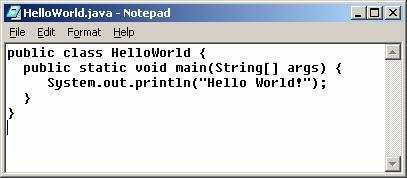

# hello-world

This is the repository for my git demo. Let's test some markdown.
- [Demo Website](http://www.google.com)

## Header2
E plurbis unum.

## Header3
- hyphen
- hyphen
- hyphen

## Header4
Instructions go here

1. One
	- hyphen
	- hyphen
 	- hyphen
2. Two: commands `> git clone https://github.com/PrintStackTrace`
3. Three
4. Four
